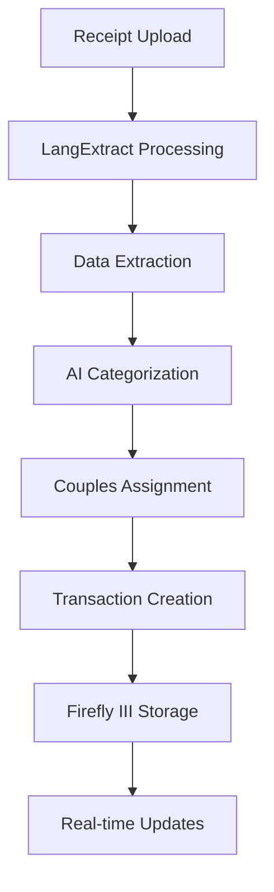

# AI-Enhanced Receipt Processing Implementation

This implementation extends the existing Firefly III Couples Dashboard with LangExtract AI integration for automatic receipt processing and transaction creation.

## 🎯 What This Implementation Provides

### Enhanced CouplesController
- **Real Transaction Creation**: Processes receipts and creates actual Firefly III transactions
- **AI Categorization**: Uses LangExtract + Ollama for intelligent expense categorization  
- **Couples Assignment**: Automatically assigns expenses to partners based on AI analysis
- **Comprehensive Logging**: Full audit trail of AI processing decisions

### API Endpoints (Enhanced)
- `POST /couples/api/upload-receipt` - Upload receipt for AI processing + transaction creation
- `POST /couples/api/process-bank-statement` - Process bank statements with AI enhancement
- `GET /couples/api/state` - Couples financial state with AI insights

### Testing Automation
- **Quick Test**: `test-ai-receipt-quick.ps1` - Fast API endpoint validation
- **Full Automation**: `test-ai-receipt-automation.js` - Complete browser-based testing
- **Comprehensive Suite**: `test-ai-receipt-complete.ps1` - Full integration testing

## 🚀 Quick Start

### 1. Start Services
```powershell
# Start Firefly III and dependencies
docker-compose -f docker-compose.local.yml up -d

# Start Ollama (in separate terminal)
ollama serve

# Pull AI model
ollama pull gemma2:4b
```

### 2. Test AI Integration
```powershell
# Quick API test
.\test-ai-receipt-quick.ps1

# Full automation test
.\test-ai-receipt-complete.ps1 -TestType full
```

### 3. Use the Interface
1. Login to Firefly III: http://localhost:8080
2. Navigate to Couples Dashboard: http://localhost:8080/couples/dashboard
3. Upload a receipt using the AI processing interface
4. Verify transaction creation in Firefly III

## 🧠 AI Processing Flow



### Processing Steps:
1. **Receipt Upload**: File uploaded via API endpoint
2. **LangExtract Processing**: Python service extracts structured data
3. **AI Categorization**: Ollama/Gemma models categorize expenses
4. **Couples Assignment**: AI determines partner responsibility
5. **Transaction Creation**: Creates actual Firefly III transaction
6. **Storage & Tagging**: Saves with AI metadata and couples tags

## 📊 AI Categorization Logic

### Categories Supported:
- **Groceries**: Food, household items, bulk purchases
- **Transportation**: Gas, car maintenance, public transit
- **Healthcare**: Medical, pharmacy, insurance
- **Utilities**: Electric, water, internet, phone
- **Entertainment**: Restaurants, movies, subscriptions
- **Personal**: Individual clothing, personal care

### Partner Assignment Logic:
- **Shared**: Groceries, utilities, housing, healthcare
- **Partner 1**: Specific personal items, individual hobbies
- **Partner 2**: Specific personal items, individual hobbies
- **Split Decision**: AI confidence-based assignment with reasoning

## 🔧 Technical Implementation

### Enhanced CouplesController Methods

#### `uploadReceipt(Request $request)`
```php
// Enhanced with real transaction creation
$request->validate([
    'receipt' => 'required|file|mimes:jpg,jpeg,png,pdf|max:10240',
    'create_transaction' => 'boolean',
    'account_id' => 'nullable|integer',
    'partner_override' => 'nullable|in:partner1,partner2,shared'
]);
```

#### `createTransactionFromReceipt()`
```php
// Creates actual Firefly III transaction with AI metadata
$transactionData = [
    'group_title' => 'Receipt: ' . $merchantName,
    'transactions' => [
        // Full transaction structure with AI tags
    ]
];
```

### AI Service Integration

#### LangExtractService
- **Receipt Processing**: Extracts merchant, amount, date, items
- **Bank Statement Processing**: Processes PDF/CSV statements
- **Multi-format Support**: Images, PDFs, text files

#### CouplesAIService  
- **Categorization**: Context-aware expense categorization
- **Assignment**: Partner responsibility determination
- **Confidence Scoring**: AI decision confidence metrics

## 📈 Sample API Response

```json
{
  "status": "success",
  "extracted_data": {
    "merchant_name": "Whole Foods Market",
    "total_amount": "32.07",
    "date": "2025-08-19",
    "items": [
      {"description": "Organic Bananas", "amount": "3.99"},
      {"description": "Avocados", "amount": "7.96"}
    ]
  },
  "ai_suggestions": {
    "category": "Groceries",
    "subcategory": "Food",
    "partner_assignment": "shared",
    "confidence": 0.92,
    "categorization_reasoning": "Multiple food items from grocery store",
    "assignment_reasoning": "Essential groceries typically shared expense"
  },
  "transaction_created": {
    "success": true,
    "transaction_id": 1234,
    "amount": 32.07,
    "description": "Whole Foods Market - Organic Bananas",
    "category": "Groceries",
    "partner_assignment": "shared",
    "ai_confidence": 0.92
  },
  "processing_time": "3.4s"
}
```

## 🧪 Testing Strategy

### Quick Validation
```powershell
# Test core functionality
.\test-ai-receipt-quick.ps1
```

### Full Integration Testing  
```powershell
# UI + API + Transaction verification
.\test-ai-receipt-complete.ps1 -TestType full -CreateTransaction

# API only testing
.\test-ai-receipt-complete.ps1 -TestType api-only

# Browser automation only
.\test-ai-receipt-complete.ps1 -TestType ui-only -Headless
```

### Manual Testing
1. Navigate to http://localhost:8080/couples/dashboard
2. Use receipt upload interface
3. Verify AI suggestions appear
4. Confirm transaction creation
5. Check transaction list for AI tags

## 🎛️ Configuration

### AI Model Configuration
```php
// In CouplesAIService
private string $model = 'gemma2:4b';  // Ollama model
private string $apiUrl = 'http://localhost:11434/api/generate';
```

### Transaction Defaults
```php
// In CouplesController
'currency_id' => 1, // USD - configurable
'category_name' => $aiSuggestions['category'] ?? 'Uncategorized',
'tags' => [
    'ai-processed',
    'couples-' . $assignment,
    'receipt-upload',
    'confidence-' . round($confidence * 100)
]
```

## 📋 Tags and Metadata

### Automatic Tags Applied:
- `ai-processed`: All AI-processed transactions
- `couples-shared|partner1|partner2`: Assignment tags
- `receipt-upload`: Source identification
- `confidence-XX`: AI confidence percentage

### Metadata Stored:
- AI reasoning for categorization
- AI reasoning for partner assignment
- Processing time and timestamp
- Original file information

## 🔍 Verification Steps

### After Receipt Processing:
1. **Transaction Created**: Check Firefly III transactions page
2. **Proper Categorization**: Verify AI-suggested category applied
3. **Couples Tags**: Confirm partner assignment tags
4. **Amount Accuracy**: Validate extracted amount matches receipt
5. **Metadata Preservation**: Check transaction notes for AI reasoning

### Monitoring & Logs:
- Laravel logs: `storage/logs/laravel.log`
- Test logs: `logs/ai-test-*.log`  
- Test reports: `reports/ai-test-report-*.json`

## 🚀 Next Steps

### Immediate:
1. Run quick test to validate setup
2. Test receipt upload via dashboard UI  
3. Verify transaction creation in Firefly III
4. Review AI categorization accuracy

### Advanced:
1. **Bank Statement Processing**: Enhance PDF processing capabilities
2. **Multi-receipt Batch**: Process multiple receipts simultaneously
3. **Learning System**: Improve AI accuracy based on user corrections
4. **Mobile Integration**: Add mobile app receipt capture
5. **Real-time Sync**: Implement partner notification system

## 🛠️ Troubleshooting

### Common Issues:

#### "Ollama not accessible"
```bash
# Start Ollama
ollama serve

# Verify model availability  
ollama list
ollama pull gemma2:4b
```

#### "Transaction creation failed"
- Check user has asset accounts in Firefly III
- Verify authentication/session status
- Check Laravel logs for specific errors

#### "AI processing slow"
- Ensure sufficient system resources
- Consider using smaller AI model
- Check network connectivity to Ollama

#### "Receipt upload fails"
- Verify file size under 10MB
- Check supported formats: jpg, jpeg, png, pdf
- Ensure proper multipart form encoding

This implementation provides a complete foundation for AI-enhanced financial document processing within the existing Firefly III infrastructure, ready for immediate testing and expansion.